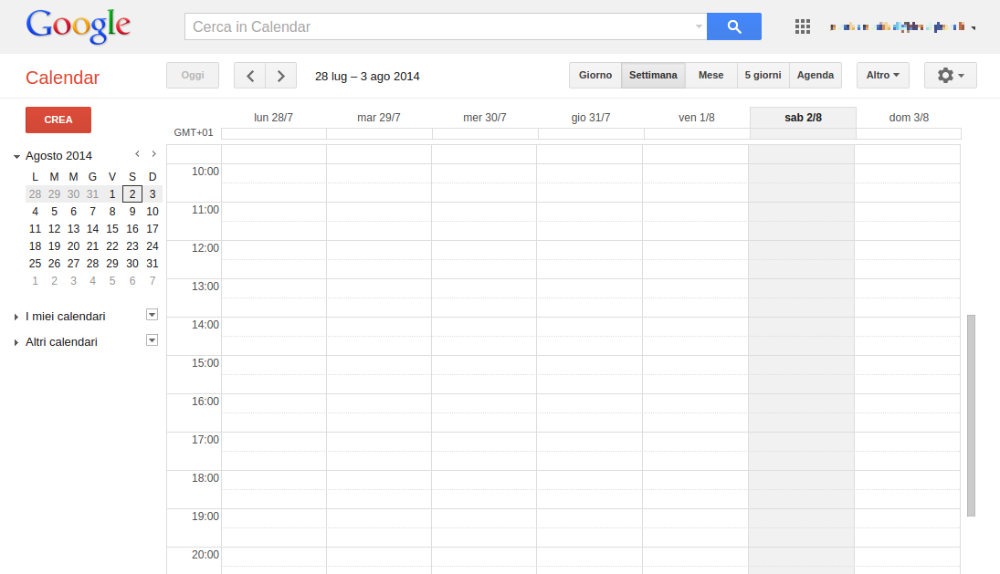
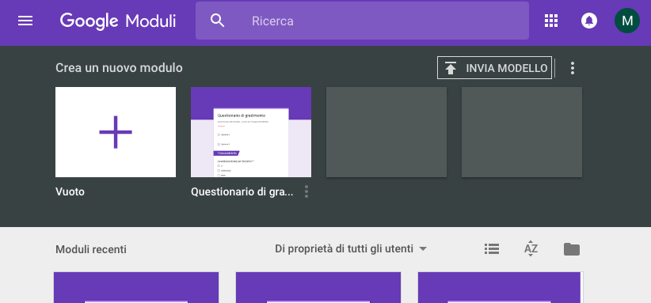
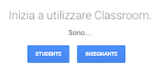
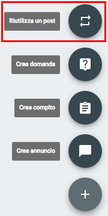

.. container::

   |Cover|

**G Suite for Education**

*Lavorare e apprendere nel cloud*

Mario Mattioli -\ http://www.mariomattioli.it/

versione S-2::26 febbraio 2017 

|Image01|

*Quest'opera è stata rilasciata con licenza Creative Commons
Attribuzione - Non commerciale 4.0 Internazionale. Per leggere una copia
della licenza visita il sito web*
http://creativecommons.org/licenses/by-nc/4.0/\ *.*

La guida “G Suite for Education - Lavorare e apprendere nel cloud” si
rivolge al personale in servizio nelle scuole italiane. È nata per
presentare i concetti di base, gli accorgimenti e le principali
procedure da conoscere per utilizzare la piattaforma G Suite for
Education in ambito scolastico. Partendo dagli argomenti più comuni, che
riguardano soprattutto lo scambio interno di informazioni, il testo si
svilupperà cercando di coprire gradualmente tutti i principali aspetti
organizzativi e didattici in cui si è dimostrato vantaggioso l’impiego
di strumenti cloud. Inevitabilmente la scelta e la trattazione degli
argomenti rispecchiano un’impostazione soggettiva. I problemi che
affronteremo sono comuni alla maggior parte dei contesti educativi, ma
le soluzioni, le convenzioni e le procedure proposte derivano
dall’esperienza e dalle preferenze personali dell’autore.

| 

| 

| 

**1 - G Suite come e perché**
=============================

Google.com è `il sito più visitato al
mondo <http://www.alexa.com/topsites>`__. Nato nel 1997 come motore di
ricerca, è ormai un colosso dell’economia globale che gestisce una
galassia di prodotti e servizi, generalmente gratuiti e fortemente
innovativi. Pur avendo esteso le proprie attività ben oltre il mondo
della Rete, Google ha continuato a sviluppare ed arricchire la sua
offerta nel campo del cloud computing. [#f1]_ La
`G Suite <https://www.google.com/edu/products/productivity-tools/>`__ si
presenta ormai come una piattaforma integrata che consente di comunicare
e di gestire contenuti digitali con grande semplicità e flessibilità. La
sua costante evoluzione la pone oggi come alternativa efficace e
conveniente rispetto ai software tradizionali, per l’uso personale e per
le organizzazioni di qualsiasi dimensione.

| 

| 

**1.1 - L’ufficio si sposta nel cloud**
---------------------------------------

Il lancio di Microsoft Office risale al 1988. La prima versione della
più diffusa suite da ufficio comprendeva Word, Excel e PowerPoint. Nel
tempo si sono aggiunte altre applicazioni ed è aumentata l’integrazione
fra i diversi componenti, che possono scambiare facilmente dati fra di
loro e condividono l’interfaccia di base. Negli stessi anni una piccola
azienda tedesca lanciava StarOffice, un pacchetto alternativo che,
acquisito da Sun Microsystems nel 1999, avrebbe costituito la base di
partenza del fortunato progetto open source [#f2]_ OpenOffice/LibreOffice.
[#f3]_ Se fino al 2000 il mondo della produttività personale è stato dominato da Microsoft,
per tutto il primo decennio del ventunesimo secolo abbiamo assistito al
confronto fra due visioni profondamente diverse dell’informatica.

Microsoft Office è un prodotto commerciale, che viene concesso in
licenza ai singoli utilizzatori e alle organizzazioni. Il produttore
autorizza il cliente ad installare e utilizzare il software su un numero
limitato di postazioni, mentre il codice che lo fa funzionare resta
segreto ed è di esclusiva proprietà di chi lo ha sviluppato. LibreOffice
non solo è gratuito e installabile su un numero illimitato di
postazioni, ma il suo codice sorgente può essere scaricato, ispezionato
e migliorato da chiunque possieda le competenze tecniche per farlo.

Molte pubbliche amministrazioni hanno quindi scelto di passare al
software open source, risolvendo diversi problemi, soprattutto di natura
economica e organizzativa, ma lasciando aperte alcune questioni che oggi
possono essere efficacemente affrontate grazie al cloud computing.
Proviamo a metterne a fuoco tre.

-  Gli utilizzatori di una suite da ufficio tradizionale sono obbligati
   a scaricare frequentemente da Internet pacchetti di aggiornamento
   che, su una connessione lenta, possono richiedere tempi lunghi.
   Completato lo scaricamento, è poi necessario portare a termine
   l’installazione e verificare che il software funzioni regolarmente.
   Anche ricorrendo a soluzioni di gestione centralizzata degli
   aggiornamenti il sistema comporta un notevole dispendio di tempo e
   traffico dati. 
-  In qualsiasi ambiente di lavoro e di studio è essenziale poter
   creare, reperire, archiviare e condividere le informazioni in modo
   efficiente. Solitamente ci si affida a
   server [#f4]_ interni, che hanno il compito di
   gestire il flusso dei dati. Questa soluzione comporta costi
   significativi che raramente le scuole sono in grado di sostenere. Non
   solo: per configurare e mantenere in condizioni di sicurezza ed
   efficienza un sistema di server aziendali sono necessarie competenze
   tecniche di alto livello, da aggiornare continuamente.
-  Le piattaforme software tradizionali sono nate in un’epoca in cui lo
   schema di riferimento prevedeva tanti singoli utenti sostanzialmente
   autonomi, che accedevano più o meno spesso alle risorse presenti su
   un elaboratore centrale. Oggi il setting ideale, in ambito educativo
   e aziendale, si basa sul lavoro collaborativo supportato dalle
   tecnologie digitali e dalla Rete. Nonostante gli sforzi degli
   sviluppatori, ci sono dei limiti che i software e i sistemi operativi
   tradizionali non possono superare. Per le suite da ufficio far
   gestire a più mani un singolo documento in modo semplice, sicuro e
   immediato resta un problema in buona parte irrisolto.

Adottando la piattaforma cloud G Suite for Education le tre questioni
possono essere affrontate con successo. Vediamo come.

-  Le applicazioni web come Google Documenti non vengono installate nel
   computer dell’utente. Il software risiede nei server del fornitore
   del servizio e viene reso disponibile attraverso un normale web
   browser. Gli aggiornamenti non sono più un problema, perché accedendo
   alla piattaforma si trova sempre l’ultima versione del software,
   direttamente dai data center di Google.
-  Oltre alle applicazioni anche i dati (file e cartelle) sono
   archiviati nei cloud server e possono contare su standard
   elevatissimi di sicurezza e affidabilità. Il `contratto di
   servizio <https://www.google.com/apps/intl/en/terms/sla.html>`__
   della G Suite garantisce il 99,9% di disponibilità, con tempo di
   inattività programmato pari a zero. L’intera piattaforma è a
   disposizione sempre e ovunque, in ufficio, a casa e in mobilità.
-  Le applicazioni cloud sono l’ideale per la collaborazione a distanza.
   Basta condividere un documento con singoli utenti o gruppi,
   assegnando a ciascuno i privilegi desiderati, per immergersi in un
   ambiente collaborativo semplice e funzionale. Tutte le modifiche
   vengono memorizzate automaticamente ed è sempre possibile recuperare
   le versioni precedenti di un file. Se più persone intervengono in
   contemporanea sullo stesso documento, il software rende
   immediatamente riconoscibile il contributo di ciascuno e offre anche
   strumenti per la comunicazione in tempo reale. Pubblicando un
   documento nel web e continuando a modificarlo, i visitatori hanno
   accesso automaticamente all’ultima versione disponibile.

| 

| 

**1.2 - Account personali o piattaforma personalizzata?**
---------------------------------------------------------

Chiunque può creare un account gratuito e iniziare subito a utilizzare i
servizi web di Google. Le funzionalità delle singole applicazioni sono
praticamente identiche per tutte le categorie di utenti, ma le
organizzazioni pubbliche e private possono richiedere l’attivazione di
un servizio ad hoc, offerto in diverse versioni:

-  `G Suite for Work <https://gsuite.google.com/intl/it/>`__\ ;
-  `G Suite for
   Education <https://www.google.com/intl/it/edu/products/productivity-tools/>`__\ ;
-  `G Suite for
   Government <https://gsuite.google.com/industries/government/>`__\ .

|Image02|

La principale differenza fra questi tre pacchetti integrati e i servizi
standard dedicati a persone singole riguarda la gestione della
piattaforma. Se, ad esempio, una scuola adotta le G Suite for Education,
può amministrare autonomamente la registrazione degli utenti, le
applicazioni disponibili, l’aspetto e il funzionamento dell’ambiente di
lavoro, l’utilizzo dei dispositivi fissi e mobili, l’archiviazione e il
monitoraggio delle comunicazioni interne. È anche possibile fornire agli
studenti, agli insegnanti e al personale non docente configurazioni
differenti, ritagliate sulle rispettive esigenze e sulle ovvie
limitazioni legate all’età e al ruolo ricoperto da ciascuno. Una
soluzione integrata migliora anche il supporto al lavoro collaborativo,
che può essere configurato in modo più semplice e flessibile.

La versione Education della G Suite è gratuita per le scuole e le
università, mentre le versioni Business e Government richiedono il
pagamento di una quota mensile o annuale per ogni utente registrato.
Tutte e tre le versioni prevedono l’attivazione di una piattaforma
autonoma e completamente amministrabile, associata a un dominio web
personalizzato. Le applicazioni principali, perfettamente integrate fra
loro, sono subito disponibili. In più è possibile attivare una lunga
serie di servizi aggiuntivi sviluppati da Google o da altri. Il nucleo
centrale della G Suite è costituito da:

-  Gmail;
-  Drive (Documenti, Fogli di lavoro, Presentazioni, Moduli…);
-  Calendar;
-  Hangouts;
-  Sites.

Le applicazioni aggiuntive sviluppate direttamente da Google sono
attivabili dal pannello di amministrazione, mentre quelle create da
altre società sono reperibili nel `G Suite
Marketplace <https://apps.google.com/marketplace/>`__.

|Image03|

| 

| 

**1.3 - Perché adottare la G Suite a scuola**
---------------------------------------------

Le motivazioni che possono spingere una istituzione educativa verso la G
Suite sono molte. Fra di esse, a mio avviso, le principali riguardano:

-  **l’abbattimento dei costi** - le scuole non pagano nulla per un
   servizio di altissimo livello, che consente la dematerializzazione di
   un gran numero di procedure; il risparmio di risorse (tempo, carta,
   spese telefoniche, licenze software, assistenza tecnica…) è immediato
   e consistente;
-  **l’ambiente di lavoro familiare** - molti utenti della Rete
   utilizzano già le applicazioni Google per scelta personale; ritrovare
   interfacce gradite e familiari nel contesto scolastico semplifica
   enormemente l’avvio dei nuovi processi e la relativa formazione;
-  **la salvaguardia dei dati** - lo smarrimento e il guasto di
   qualsiasi dispositivo non costituiscono più un problema; con un
   minimo di attenzione nella gestione dei file, delle password e degli
   account utente si può raggiungere un livello di sicurezza
   elevatissimo;
-  **il supporto alla collaborazione** - la G Suite è pensata per
   assecondare e semplificare il lavoro collaborativo; non si tratta di
   funzioni aggiunte in un secondo tempo, ma di una caratteristica del
   suo DNA;
-  **la disponibilità sempre e ovunque** - una continuità del servizio
   ai massimi livelli e il costante sviluppo di interfacce e
   applicazioni mobili mette la piattaforma Google a nostra disposizione
   dove e quando ne abbiamo effettivamente bisogno.

Per i responsabili di una infrastruttura informatica, ovviamente, c’è
molto di più. Dal pannello di controllo della G Suite è possibile
gestire qualsiasi aspetto del funzionamento della posta elettronica e
degli altri servizi attivando, disattivando o limitando specifiche
funzioni. Le scuole possono utilizzare gratuitamente il prezioso
servizio chiamato
“\ `Vault <http://https://gsuite.google.com/intl/it/products/vault/>`__\ ”,
che consente di effettuare ricerche sui dati archiviati nell’intera
piattaforma. A questo proposito è importante sottolineare che gli
amministratori possono accedere in diversi modi ai dati degli utenti,
anche forzando il reset della password. Gli utenti devono sapere, nel
momento in cui ricevono le credenziali di accesso, che l’ambiente di
lavoro online offerto gratuitamente dalla scuola non è adatto alla
gestione di comunicazioni e dati personali riservati.

| 

| 

**1.4 - Siete pronti per il cloud?**
------------------------------------

I servizi cloud, per le loro caratteristiche specifiche, non sono adatti
a tutte le situazioni. Prima di adottare la G Suite è indispensabile
verificare la presenza di alcuni prerequisiti essenziali:

-  **una connessione affidabile a Internet** - le applicazioni web
   utilizzano in modo efficiente lo scambio di dati con la Rete e, di
   solito, non è necessario disporre di connessioni ultraveloci; d'altra
   parte una linea Internet molto lenta o intermittente può rendere
   frustrante e poco produttiva l'esperienza d'uso;
-  **la motivazione al cambiamento** - tutto il personale coinvolto deve
   essere, se non entusiasta, quantomeno aperto e disponibile nei
   confronti di un significativo rinnovamento del proprio modo di
   lavorare;
-  **la compatibilità dei processi** - nessuna applicazione web può
   ancora reggere il confronto con i più blasonati software tradizionali
   quanto a funzioni disponibili; nella maggior parte dei casi la
   semplicità della G Suite è un vantaggio, ma se manca all'appello
   qualcosa di cui avete assolutamente bisogno e che è impossibile
   sostituire in modo efficiente con il cloud, vi conviene restare
   fedeli ai programmi che utilizzate già, in attesa di ulteriori
   sviluppi.

| 

| 

**1.5 - Il cloud è sicuro?**
----------------------------

Nel 2013 il `caso
Snowden <http://www.lastampa.it/2013/10/27/esteri/cose-da-sapere-sullo-scandalo-oSs4F1uOX5VuWvtIBx29YP/pagina.html>`__
ha acceso i riflettori sulla sicurezza dei nostri dati in rete.
L’opinione pubblica ha reagito con un sentimento di generale diffidenza
nei confronti dei servizi online, pur continuando in larga maggioranza a
utilizzarli. D’altra parte già nel 2008 Richard Stallman, storico
sostenitore del software libero, `si lasciava andare a giudizi
totalmente
negativi <http://www.theguardian.com/technology/2008/sep/29/cloud.computing.richard.stallman>`__
sul cloud computing. In realtà il problema della riservatezza dei dati
andrebbe considerato da un punto di vista più generale, perché il nostro
computer può rivelarsi molto più facile da violare di qualsiasi cloud
server. Curare la sicurezza e la riservatezza delle informazioni
significa senz’altro riflettere sugli strumenti e sulle tecnologie, ma
soprattutto richiede l’adozione di comportamenti prudenti e consapevoli.
Nel contesto scolastico, ad esempio, il rischio di smarrire pen-drive
contenenti dati sensibili è ben più rilevante rispetto all’eventualità
di essere spiati da un servizio segreto straniero. In ogni caso
qualunque organizzazione, prima di adottare una piattaforma cloud, deve
valutarne con attenzione le condizioni di utilizzo e le norme per la
tutela della privacy. `Questa
pagina <https://support.google.com/a/answer/139019?hl=it>`__ è un buon
punto di partenza per informarsi sui termini del servizio offerto da
Google e per verificarne la compatibilità con i propri standard
normativi e qualitativi.

Il `6 ottobre
2015 <http://www.ilpost.it/2015/10/06/la-sentenza-contro-il-safe-harbor/>`__
la Corte di Giustizia dell’Unione Europea ha di fatto invalidato
l’accordo Safe Harbor, che dal 2000 consentiva alle aziende americane di
esportare i dati degli utenti fuori dall’Unione Europea con il consenso
delle autorità del vecchio continente. Pochi giorni dopo, il 15 ottobre,
Google ha inviato agli amministratori delle Apps una lettera di cui
riporto il testo integrale:

*Hello Apps Administrator,*

*Please note that the update below is relevant only if you process
personal data and European Data Protection laws apply to that
processing. This will often be the case if your business is based in the
European Union. If you are unsure whether this applies to you, we
suggest you seek advice from legal counsel.*

*On October 6, 2015, Europe’s highest court*
`declared <http://curia.europa.eu/jcms/upload/docs/application/pdf/2015-10/cp150117en.pdf>`__
*that the decision of the European Commission regarding the* `US-EU Safe
Harbor framework <http://export.gov/safeharbor/>`__\ ―\ *one of the
legal mechanisms that enables the transfer of personal data from the EU
to US companies*\ ―\ *is invalid, on the basis that Safe Harbor doesn’t
provide an adequate level of protection for personal data originating in
the EU.*

*Through 2015, the European Commission and the US have been negotiating
a revised Safe Harbor agreement that should address these concerns, but
they were not able to finalize the agreement before the court issued its
ruling. Both the Commission and the US have committed to finalizing the
revised agreement as soon as possible.*

*In the meantime, we’d like to reassure you that we offer a compliance
alternative to the Safe Harbor framework, and our records show that your
organization has already adopted this option. Specifically, we*
`offer <http://googleforwork.blogspot.com/2012/06/google-apps-to-offer-additional.html>`__
*a* `data processing
amendment <https://www.google.com/work/apps/terms/dpa_terms.html>`__
*and* `model contract
clauses <https://www.google.com/work/apps/terms/mcc_terms.html>`__ *as
an additional means*\ ―\ *beyond the Safe Harbor framework*\ ―\ *of
meeting the adequacy and security requirements of the EU* `Data
Protection
Directive <http://europa.eu/legislation_summaries/information_society/data_protection/l14012_en.htm>`__\ *.
Model contract clauses were created specifically by the European
Commission to permit the transfer of personal data from Europe.*

*We are committed to helping our customers address their regulatory
compliance needs in this area, and we thank you for entrusting your data
to Google.*

*If you have additional questions, please contact your Google
representative or* `Google Apps
Support <https://support.google.com/a/#topic=29157&contact=1>`__\ *.*

*Sincerely,*

*The Google Apps Team*

La lettera fa riferimento, fra l’altro, ad accordi e clausole
supplementari sul trattamento dei dati, già disponibili da tempo
all’interno del pannello di amministrazione della piattaforma. Si è
trattato comunque di una soluzione transitoria, in attesa dell’entrata
in vigore del nuovo accordo denominato “\ `Privacy
Shield <http://europa.eu/rapid/press-release_IP-16-2461_it.htm>`__\ ”.

Google ha aderito al nuovo framework il 22 settembre 2016. La `scheda
dell’azienda <https://www.privacyshield.gov/participant?id=a2zt000000001L5AAI>`__
nel sito governativo del progetto offre un accesso immediato alla
documentazione e i riferimenti per eventuali reclami. Le principali
novità rispetto al Safe Harbor riguardano:

-  un programma di verifiche periodiche sulla conformità delle aziende
   partecipanti;
-  il monitoraggio annuale del funzionamento dello scudo, da parte delle
   autorità statunitensi ed europee;
-  la regolamentazione dell’accesso ai dati da parte del governo
   americano;
-  l’istituzione di meccanismi di mediazione per offrire ai cittadini
   europei una via di ricorso contro l’accesso ai dati da parte delle
   agenzie governative statunitensi;
-  l’attivazione di procedure semplici ed economiche per la protezione
   contro gli abusi, anche con il coinvolgimento delle autorità
   nazionali (in Italia il Garante per la protezione dei dati
   personali).

Nel mese di settembre 2016 ho pubblicato nel mio blog `una breve
riflessione <http://www.mariomattioli.it/2016/09/11/google-apps-a-scuola-si-puo/>`__
su privacy, sicurezza e lock-in.

| 

| 

| 

**2 - Le applicazioni web di Google**
=====================================

Le tecnologie che fanno funzionare la G Suite utilizzano come
piattaforma il web. Hanno bisogno di un browser aggiornato e di una
connessione a Internet, nient’altro. Queste tecnologie, strettamente
legate alle nuove architetture cloud, si stanno affermando in molti
settori perché sono più efficienti rispetto ai programmi installati
nelle singole postazioni di lavoro. Una delle loro carte vincenti
riguarda la totale libertà di movimento: non è più necessario essere
presenti contemporaneamente nello stesso luogo per lavorare in gruppo.
Neanche il tempo è più un problema, perché si può intervenire in
differita sullo stesso progetto, rendendo facilmente accessibili e
riconoscibili i contributi e le modifiche di ciascuno. Questi vantaggi,
uniti ai risparmi e alla semplificazione nella gestione delle
infrastrutture informatiche, hanno decretato il rapido successo di
servizi come Gmail, Drive e Calendar. Nelle prossime pagine passeremo
rapidamente in rassegna le principali applicazioni offerte da Google,
evidenziandone le caratteristiche più rilevanti in funzione di una loro
possibile adozione da parte delle istituzioni educative.

| 

| 

**2.1 - Gmail**
---------------

|Image04|

Chiunque può creare la propria casella di posta elettronica gratuita
@gmail.com. La registrazione dà accesso, con una sola password,
all'intera galassia di servizi Google. Attivando la piattaforma G Suite
for Education si ottiene qualcosa in più. Dal punto di vista dell’utente
i vantaggi principali sono tre:

-  lo spazio di archiviazione diventa illimitato;
-  gli indirizzi di posta elettronica sono creati su un dominio
   personalizzato (nomescuola.it), non su gmail.com;
-  è possibile richiedere la conferma di lettura quando si invia un
   messaggio.

Alcune caratteristiche particolari che hanno contribuito al successo di
Gmail sono comunque presenti in tutte le tipologie di account:

-  i messaggi vengono automaticamente raccolti in conversazioni,
   allineando in ordine cronologico in una sola pagina le risposte con
   lo stesso oggetto;
-  ogni conversazione può essere archiviata associandola a una o più
   etichette;
-  la potente funzione di ricerca di Google è integrata nella posta
   elettronica e consente di trovare facilmente qualsiasi informazione
   in una frazione di secondo;
-  è comunque possibile utilizzare Gmail con i tradizionali programmi di
   posta elettronica, come Mozilla Thunderbird, Apple Mail e Microsoft
   Outlook.

Gmail è anche perfettamente integrato con Drive. All’interno della
casella di composizione dei messaggi si possono selezionare file e
cartelle da allegare e condividere con i destinatari. Generalmente non
si tratta di veri e propri allegati, ma di link che aprono direttamente
il file o la cartella all’interno di Drive. In questo modo tutti
accedono allo stesso contenuto, senza creare duplicati.

|Image05|

È anche possibile inserire i file come allegati di tipo tradizionale,
incorporati nel messaggio di posta elettronica. Questa funzione non è
disponibile per i documenti creati dalle applicazioni web di Google.

| 

| 

**2.2 - Drive**
---------------

|Image06|

`Google Drive <https://www.google.com/intl/it_it/drive/>`__ è anzitutto
uno spazio di archiviazione. Lo possiamo utilizzare come un disco
rimovibile USB, spostando o copiando file e cartelle fra Drive e il
disco interno del nostro computer. Visto che risiede nel cloud è sempre
a disposizione, purché sia presente una connessione a Internet.
L’aspetto della schermata iniziale ricorda i sistemi operativi
tradizionali: a sinistra c'è una barra di navigazione ad albero, al
centro appare il contenuto della cartella prescelta, a destra è
possibile attivare e disattivare un pannello che mostra i dettagli
dell'oggetto selezionato. L'aspetto e il comportamento di ogni elemento
sono concepiti per offrirci un ambiente familiare che annulli le
differenze fra disco interno del computer e cloud. In questo spazio
chiunque abbia un account Google può caricare e organizzare qualsiasi
genere di contenuto digitale. È anche disponibile un software per Mac e
Windows che sincronizza automaticamente il contenuto di Drive con una
cartella del computer. Ovviamente file e cartelle possono essere
condivisi con altri utenti, concedendo o meno il permesso di modificarne
il contenuto. La versione Education di Drive non ha limiti di spazio,
ogni singolo utente può caricare tutti i dati di cui ha bisogno. Il
limite massimo per le dimensioni di un file equivale a 5
Terabyte. [#f5]_

| 

| 

**2.3 - Documenti, Fogli di lavoro e Presentazioni**
----------------------------------------------------

|Image07|

Anche Google ha il suo Office ed è interamente nel cloud. Si trova
all’interno di Drive e utilizza dei tipi di file molto speciali. Se li
sincronizziamo con il computer ci accorgiamo che sono in realtà solo dei
segnalibri che rimandano a una pagina web. I dati risiedono sui server
di Google e il programma che ci consente di modificarli viene caricato
all’interno del browser. Questa particolare configurazione è vantaggiosa
sotto molti punti di vista. Per prima cosa non è più necessario
installare il software, né aggiornarlo. In secondo luogo, trattandosi di
pagine web, un gruppo di persone può modificarle in modo sincrono o
asincrono, senza rischiare di sovrapporsi e tenendo automaticamente
traccia di tutte le versioni di ogni documento. Le applicazioni cloud di
Drive sono comunque compatibili con Microsoft Office e LibreOffice: i
file creati da Word, Excel, Powerpoint, Writer, Calc e Impress possono
essere convertiti nei formati Google e viceversa. Di recente è stata
introdotta un’estensione che permette di modificare velocemente i file
di Office anche senza convertirli, con un numero limitato di funzioni.

Le tre applicazioni di base si chiamano:

-  `Google
   Documenti <https://www.google.com/intl/it_it/docs/about/>`__\ ;
-  `Google Fogli di
   lavoro <https://www.google.com/intl/it_it/sheets/about/>`__\ ;
-  `Google
   Presentazioni <https://www.google.com/intl/it_it/slides/about/>`__\ .

Le funzioni disponibili sono più che sufficienti per l’uso normale
all’interno di una scuola. In più troviamo alcuni strumenti innovativi
per il lavoro collaborativo, che possono rivelarsi preziosi sia nel
lavoro quotidiano del personale docente e non docente, sia durante le
attività didattiche.

Tutte le modifiche sono memorizzate automaticamente in una sequenza
cronologica, grazie alla quale si possono ricostruire nel dettaglio le
fasi di sviluppo di un documento. La collaborazione in tempo reale è
pienamente supportata: ogni utente collegato riceve un cursore colorato
che lo rende immediatamente riconoscibile. Anche i commenti e le
proposte di modifica portano con sé l’identità di chi li ha inseriti,
all’interno di veri e propri “fili di discussione” agganciati a porzioni
del testo.

| 

| 

**2.4 - Calendar**
------------------

|Image08|

Un gestore di calendari online può rivelarsi prezioso per organizzare il
lavoro di un gruppo o di un’intera organizzazione. Ogni utente può
creare tutti i calendari di cui ha bisogno, scegliendo se condividerli
con altri e a quali condizioni. Quando un calendario è condiviso tutte
le persone autorizzate possono vederne gli eventi e ricevere notifiche,
anche sui dispositivi mobili. In più, se si dispone della piattaforma G
Suite,
`Calendar <https://gsuite.google.com/intl/it/products/calendar/>`__
consente una gestione ottimale dei tempi e degli spazi. È possibile
creare degli **intervalli** con fasce orarie standard, a disposizione di
chi voglia prenotare un appuntamento. Gli amministratori possono
predisporre un elenco di **risorse** associabili ai singoli eventi di
calendario. Se una risorsa è prenotata è impossibile aggiungerla ad
altri eventi nella stessa fascia oraria. In una scuola, ad esempio, ogni
laboratorio, aula speciale, LIM mobile, proiettore portatile e qualsiasi
altro spazio o attrezzatura può rappresentare una risorsa associabile
agli eventi. I calendari possono anche essere resi pubblici e
incorporati, ad esempio, nelle pagine del sito web dell’Istituto.

| 

| 

**2.5 - Hangouts**
------------------

|Image09|

La piattaforma Google integra uno strumento molto sofisticato per la
gestione di chat e audio/video conferenze. È il risultato di una lunga
evoluzione iniziata alcuni anni fa con Google Talk, poi proseguita con
Google Voice e Google+ Messenger. Dal 2013 tutti questi servizi sono
confluiti in `Google
Hangouts <http://www.google.it/intl/it/hangouts/>`__, utilizzabile con
il browser Chrome su computer e con applicazioni specifiche per iOS e
Android sui dispositivi mobili.

Oltre a supportare la chat testuale, le conversazioni in voce e la
videoconferenza, [#f6]_ Hangouts ha una
caratteristica che lo rende particolarmente prezioso, soprattutto in
ambito educativo e aziendale: durante un collegamento è possibile
lavorare in contemporanea su un documento di Drive, vedere un video di
YouTube o condividere l’ambiente di lavoro di molte altre applicazioni.
Un gruppo di studenti che non hanno modo di incontrarsi personalmente al
di fuori dell’orario scolastico può quindi realizzare facilmente un
compito cooperativo. Un team di docenti può elaborare il proprio
progetto didattico riunendosi virtualmente senza le complicazioni e i
costi degli incontri di coordinamento in presenza. Google Hangouts è un
vero e proprio ambiente di lavoro collaborativo sincrono, che si integra
perfettamente con gli strumenti asincroni presenti nelle altre
applicazioni.

| 

| 

**2.6 - Sites**
---------------

|Image10|

Il concetto di *wiki* è ormai diffuso da più di un decennio. Identifica
un sito web che si può leggere e scrivere, nel quale gli utenti
contribuiscono alla creazione e all’aggiornamento delle pagine.
L’esempio più noto è senz’altro l’enciclopedia online
`Wikipedia <http://it.wikipedia.org/>`__. `Google
Sites <https://www.google.it/intx/it/work/apps/business/products/sites/>`__
riprende questo concetto aggiungendo le sofisticate funzioni
collaborative che abbiamo già visto in Drive. Nella versione “classica”
di Sites (tuttora disponibile) il proprietario del sito può abilitare
utenti e gruppi alla visualizzazione e alla modifica di ogni singola
pagina, attivando le “autorizzazioni a livello di pagina”. Un docente
che coordina lo sviluppo di un ipertesto, ad esempio, consentirà ai suoi
studenti la visualizzazione dell’intero sito di classe, abilitando solo
alcuni di essi alla modifica di determinate pagine.

|Image11|

La nuova versione di Sites (ancora in beta) non offre questo livello di
controllo, ma probabilmente l’opzione sarà resa disponibile in uno dei
prossimi aggiornamenti.

In entrambe le versioni i contenuti possono essere privati, aperti solo
agli utenti registrati nel dominio della scuola, oppure liberamente
accessibili nel web. La perfetta integrazione con gli altri strumenti
della G Suite può rendere le pagine dinamiche e fortemente interattive,
senza richiedere competenze tecniche specifiche. L’interfaccia di
modifica delle pagine è stata recentemente rinnovata, per renderla
ancora più semplice e intuitiva. I contenuti costituiscono dei *blocchi*
che possono essere trascinati liberamente in alto e in basso.
L’inserimento di immagini e altri elementi multimediali è semplicissimo,
mentre i file di Drive, i calendari e le mappe possono essere
incorporati in modalità *live*, sempre aggiornati con le ultime
modifiche.

|Image12|

| 

| 

**2.7 - Classroom**
-------------------

`Classroom <https://www.google.com/intl/it/edu/products/productivity-tools/classroom/>`__
è un ambiente di apprendimento online sviluppato appositamente per il
mondo della formazione. Attualmente è disponibile solo all’interno dei
domini autorizzati all’utilizzo della G Suite for Education. Pubblicato
per la prima volta nell’agosto 2014 in una versione ancora semplice ed
essenziale, Classroom è stato costantemente sviluppato e dotato di nuove
funzioni. Nella sua configurazione iniziale appariva già valido come
strumento integrativo rispetto alla didattica in aula, ma non
sufficiente per svolgere percorsi formativi interamente o
prevalentemente in rete. Pur essendo un progetto relativamente giovane
Classroom è già in grado di competere con piattaforme e-learning molto
più blasonate. Rispetto ad esse presenta ancora una gamma di
funzionalità limitata, ma può vantare un’interfaccia moderna e
amichevole, un’eccellente esperienza d’uso anche sui dispositivi mobili
e una perfetta integrazione con le altre applicazioni Google.

|Image13|

| 

| 

**2.8 - Aggiungere altre app**
------------------------------

Quando acquistiamo un computer di tipo tradizionale troviamo in genere
preinstallati il sistema operativo e un pacchetto di programmi che
svolgono le operazioni più comuni. In seguito possiamo aggiungere altri
software, gratuiti o a pagamento, ed espandere le potenzialità del
computer all'infinito. Google ha realizzato un sistema simile nel cloud,
consentendo agli sviluppatori di creare applicazioni web che aggiungono
nuove funzioni all'ambiente di lavoro. Gli amministratori possono
attivare nuovi servizi da offrire all'interno del dominio collegandosi
al `G Suite
Marketplace <https://apps.google.com/marketplace/?pann=gam>`__. In più
il singolo utente può scegliere di installare autonomamente dal pannello
delle impostazioni altre applicazioni predisposte per integrarsi con
Google Drive.

|Image14|

| 

| 

| 

**3 - Primi passi con la G Suite**
==================================

In questo capitolo sono descritte alcune procedure molto comuni, che
interessano le applicazioni principali della G Suite. È stato adottato
il punto di vista dell’utente finale.

| 

| 

**3.1 - Allestimento dell’ambiente di lavoro**
----------------------------------------------

Istruzioni e consigli per essere subito operativi: quali strumenti
utilizzare, come configurare lo spazio di lavoro, come accedere alle
informazioni importanti e come proteggere i dati.

| 

**3.1.1 - Il browser**
~~~~~~~~~~~~~~~~~~~~~~

La G Suite funziona con tutti i principali web browser: Firefox, Chrome,
Safari e Internet Explorer. Firefox, in generale, è un’ottima scelta
perché è *open source* e garantisce un alto livello di privacy e
sicurezza. D’altra parte Chrome offre la migliore esperienza d’uso
quando si lavora con la G Suite, perché è progettato e sviluppato
appositamente per questo. È anche possibile sincronizzare la sua
interfaccia di navigazione, i preferiti e le password fra diversi
dispositivi, utilizzando l’account Google della scuola. Gli
aggiornamenti sono automatici e non richiedono interventi da parte
dell’utente. Infine, grazie alla piattaforma G Suite for Education,
l’amministratore può personalizzare le applicazioni disponibili e le
impostazioni del browser per ogni singola categoria di utenti.

Di norma conviene installare
`Chrome <https://www.google.it/chrome/browser/desktop/>`__ per
utilizzarlo abitualmente con la piattaforma Google. È comunque
consigliabile avere a disposizione anche l’ultima versione di
`Firefox <https://www.mozilla.org/it/firefox/new/>`__, sia se lo si
preferisce per la normale navigazione nel web sia come browser
alternativo, da usare nelle rare occasioni in cui Chrome non dovesse
funzionare a dovere.

| 

**3.1.2 - Altre applicazioni**
~~~~~~~~~~~~~~~~~~~~~~~~~~~~~~

Esistono alcune applicazioni specifiche per i diversi sistemi operativi,
create da Google per offrire una maggiore integrazione fra computer e
web. Nessuna di esse è indispensabile per lavorare con la piattaforma
online della scuola. Se intendete utilizzare molto Drive come archivio
di materiali nel cloud potrebbe essere comunque una buona idea
installare l’applicazione nativa per Mac e Windows, che sincronizza
automaticamente le cartelle online con il disco rigido del computer.

Per lavorare con la G Suite nei dispositivi mobili (smartphone e tablet)
ci sono due strade:

-  -collegarsi con il web browser;
-  -installare le applicazioni realizzate appositamente per il proprio
   sistema operativo.

Nel primo caso l’accesso è immediato, ma funzioni e usabilità sono
limitati. Se si usano spesso i servizi Google con il telefono o con il
tablet è molto meglio installare le relative applicazioni, disponibili
attualmente per i due principali sistemi operativi mobili:
`Android <https://play.google.com/store/apps/developer?id=Google%20Inc.&hl=it>`__
e `iOS <https://itunes.apple.com/us/artist/google-inc./id281956209>`__.

| 

**3.1.3 - Primo accesso in piattaforma**
~~~~~~~~~~~~~~~~~~~~~~~~~~~~~~~~~~~~~~~~

Di norma al primo accesso l’utente utilizza una password provvisoria,
che deve essere subito personalizzata.

Al termine di questa breve procedura è necessario “arredare” l’ambiente
con alcuni oggetti, necessari per accedere alle risorse condivise della
scuola. Si tratta dei Documenti condivisi e del Calendario (o dei
calendari) d’Istituto.

I link a queste risorse vengono inviati solitamente dall’amministratore
con un messaggio di benvenuto e bastano pochi clic per aggiungerle al
proprio spazio di lavoro. Quando apriamo per la prima volta la cartella
condivisa Drive la colloca in una sezione specifica, denominata
“Condivisi con me”.

| 

|Image15|

Per poterla visualizzare e gestire più comodamente dobbiamo utilizzare
il comando “Aggiungi a Il mio Drive”.

|Image16|

Da quel momento in poi avremo a disposizione la cartella all’interno
dello spazio chiamato “Il mio Drive”.

Anche per iscriversi a uno o più calendari condivisi è sufficiente
cliccare sul link che ci viene inviato per posta elettronica
dall’amministratore e poi su “Sì, aggiungi questo calendario”:

|Image17|

Se stiamo entrando in Calendar per la prima volta dobbiamo anche
completare la procedura di configurazione iniziale, cliccando sui
pulsanti blu che appaiono ad ogni passaggio.

| 

**3.1.4 - Sicurezza**
~~~~~~~~~~~~~~~~~~~~~

|Image18|

È fondamentale non lasciare mai aperto il proprio account in un computer
utilizzato da altri utenti, anche se si tratta di familiari. La
piattaforma contiene dati personali degli studenti, che solo noi siamo
autorizzati a visualizzare. Per uscire è sufficiente cliccare su “Esci”
nel menu che si trova in alto a destra in tutte le pagine della
piattaforma.

Molti utenti inseriscono per errore i propri dati nella schermata di
accesso del browser Chrome, il cui aspetto può trarre facilmente in
inganno. Se ciò dovesse accadere in una postazione pubblica è necessario
disconnettere il proprio account entrando nelle impostazioni di Chrome.

|Image19|

Un’altra precauzione da osservare riguarda i file scaricati nel
computer. Spesso, durante la navigazione, vengono salvati file in vari
formati (soprattutto pdf) per la visualizzazione e la stampa. Uscire
dalla piattaforma, ovviamente, non ripulisce il disco rigido locale,
quindi i file scaricati vanno cancellati manualmente. Di solito il
browser salva tutto in una cartella standard chiamata “Download” o “File
scaricati”.

| 

| 

**3.2 - Redazione e gestione dei documenti**
--------------------------------------------

Dopo averne presentato le origini e le caratteristiche principali,
approfondiamo la conoscenza delle procedure più comuni che rendono
Google Drive uno strumento di uso quotidiano per docenti, personale
tecnico-amministrativo e studenti. Nel contesto scolastico l’elemento di
maggiore interesse è sicuramente la collaborazione. Quando si condivide
con qualcuno un documento si può lavorare insieme alla sua redazione,
mantenendo traccia di tutte le modifiche. Le applicazioni supportano
anche il lavoro sincrono, gestendo efficacemente gli interventi di più
utenti collegati contemporaneamente.

| 

**3.2.1 - Creazione e caricamento di file**
~~~~~~~~~~~~~~~~~~~~~~~~~~~~~~~~~~~~~~~~~~~

|Image20|

Il pulsante azzurro “Nuovo” consente la creazione di file e cartelle
vuoti. I formati disponibili possono variare in base alle applicazioni
installate in Google Drive. Affidandosi solo alle funzioni standard si
hanno già a disposizione tutti i principali tipi di file:

-  Documenti;
-  Fogli di lavoro;
-  Presentazioni;
-  Disegni.

In più è possibile creare moduli online che raccolgono dati in tabelle,
offrendo anche un’analisi grafica dei risultati. Il modulo può essere
facilmente trasformato in un quiz, con correzione automatica delle
risposte.

Lo stesso menu del pulsante “Nuovo” sono presenti i comandi per caricare
file e cartelle. Nella maggior parte dei casi si può utilizzare un
metodo ancora più rapido: il *drag ‘n’ drop*, cioè il trascinamento
diretto di oggetti dal computer alla finestra di Google Drive.

|Image21|

L’icona a forma di ingranaggio che si trova in alto a destra nella
schermata principale di Google Drive dà accesso alle impostazioni.
Attivando la funzione “Converti caricamenti” tutti i file compatibili
vengono convertiti nel formato Google corrispondente, altrimenti i file
sono caricati senza conversione.

|Image22|

Il processo di conversione non è sempre perfetto: i file di Word con
formattazione complessa, ad esempio, possono apparire molto diversi
dall’originale dopo la trasformazione in documenti Google. Di norma
conviene non attivare la conversione automatica, per conservare intatto
l’riginale. All’occorrenza, con due clic, si può creare una copia del
documento in formato Google per lavorarci online.

|Image23|

| 

**3.2.2 - La galleria modelli**
~~~~~~~~~~~~~~~~~~~~~~~~~~~~~~~

La nuova galleria modelli della G Suite è integrata nelle singole
applicazioni e si trova nella homepage di Documenti, Fogli di lavoro,
Presentazioni e Moduli. Cliccando su un modello ne viene creata
automaticamente una copia. In alto a destra c’è il pulsante da
utilizzare per caricarne altri.

|Image24|

| 

Nella schermata principale di Drive, quando si crea un nuovo file, è
presente un sottomenu che offre un accesso rapido ai modelli.

|Image25|

| 

Per accedere alla galleria si può anche fare clic sul menu “File” di un
qualsiasi documento aperto, selezionando “Nuovo - Da modello…”:

| 

|Image26|

| 

**3.2.3 - Condividere file e cartelle**
~~~~~~~~~~~~~~~~~~~~~~~~~~~~~~~~~~~~~~~

Ci sono due modi per condividere un file:

-  modificare le sue impostazioni di condivisione;
-  spostarlo in una cartella condivisa.

| 

Per cambiare le impostazioni di condivisione del singolo file bisogna
utilizzare il pulsante azzurro che appare in alto a destra dopo aver
aperto il documento per modificarlo.

Se il file è **privato** sul pulsante appare un lucchetto:

|Image27|

Se il file è **condiviso** appare invece un’icona con due figure
stilizzate:

|Image28|

Nella prima finestra che si apre dopo aver cliccato sul pulsante di
condivisione abbiamo la possibilità di aggiungere rapidamente una o più
persone (o gruppi). Nel menù a tendina possiamo selezionare il tipo di
accesso da concedere agli altri utenti (modifica, commento o
visualizzazione).

|Image29|

Cliccando su “Avanzate” appaiono le impostazioni complete, con l’elenco
di chi ha già accesso e la possibilità di modificarne i privilegi. Anche
da questa finestra è comunque possibile aggiungere persone e gruppi. La
piattaforma invia automaticamente un messaggio di posta elettronica agli
utenti con cui viene attivata la condivisione. Il messaggio può essere
personalizzato o anche disattivato. Di norma conviene farlo partire,
perché ciò semplifica l’accesso al file da parte di chi lo riceve.
D’altra parte, quando un gran numero di persone condivide in questo modo
con un singolo destinatario, la sua posta diventa rapidamente
ingovernabile.

Un’altra opzione importante che troviamo nel pannello di condivisione
riguarda i permessi del proprietario e degli editor. Il proprietario, di
norma, è l’utente che ha creato il file. Solo lui può trasferire la
proprietà ad un altro, declassando se stesso al ruolo di editor. Un
documento può essere condiviso con un massimo di 200 persone o gruppi,
ma può avere un solo proprietario. Nell’uso normale editor e
proprietario hanno le stesse prerogative. Entrambi possono modificare e
rinominare il file, oltre a invitare altri a modificarlo, commentarlo o
visualizzarlo. Cliccando su [Modifica] in basso a destra nelle
impostazioni di condivisione:

|Image30|

si accede a una finestra che consente di limitare al solo proprietario
la modifica delle autorizzazioni.

|Image31|

| 

**3.2.4 - Spostare oggetti in una cartella condivisa**
~~~~~~~~~~~~~~~~~~~~~~~~~~~~~~~~~~~~~~~~~~~~~~~~~~~~~~

Spesso in una piattaforma G Suite for Education la procedura più comune
per condividere un file consiste nel suo spostamento in una cartella
condivisa. Quando, ad esempio, un insegnante *consegna* la sua
progettazione si limita a spostare il file che ha compilato nella
cartella di classe, che è già impostata in modo da essere accessibile da
parte del personale autorizzato. Tutto ciò che viene spostato o creato
all’interno di una cartella condivisa acquisisce automaticamente le
impostazioni della cartella.

Per spostare un file in una cartella basta fare clic sul pulsante che si
trova in alto accanto al nome del documento: |Image32|. Nella finestra
successiva si seleziona la destinazione prescelta, se necessario creando
la cartella dove spostare il file. Dopo aver controllato che il segno di
spunta sia nella posizione voluta si può cliccare sul pulsante “Sposta”.

|Image33|

La cartelle condivise sono sempre riconoscibili per la loro icona:
|Image34|.

| 

| 

**3.3 - Calendari d’istituto**
------------------------------

Tutti gli utenti della piattaforma hanno a disposizione un calendario
personale, che possono utilizzare per organizzare il proprio lavoro. In
più l’istituto può adottare uno o più calendari condivisi, che
semplificano la gestione del tempo, degli spazi e delle attrezzature. I
calendari condivisi, di solito, sono amministrati da un piccolo gruppo
di persone e sono accessibili per intere categorie di utenti (docenti,
genitori, gruppi di lavoro…).

Una delle prime cose che consiglio di fare a tutti i nuovi utenti è
verificare la condivisione del proprio calendario personale, utilizzando
il comando “Condividi questo calendario” che si trova nel menù a
tendina.

|Image35|

Un buon compromesso fra apertura e riservatezza potrebbe consistere nel
consentire agli altri di vedere se si è occupati, ma senza mostrare
dettagli sulle attività.

|Image36|

I calendari possono essere attivati o disattivati in qualsiasi momento
cliccando sul loro nome nella barra di controllo che si trova sul lato
sinistro della pagina:

|Image37|

Se il quadrato accanto al nome è colorato il calendario è visibile.

La barra di pulsanti che si trova nella parte superiore della pagina
permette di spostarsi avanti e indietro nel tempo e di scegliere il tipo
di visualizzazione fra:

-  Giorno singolo;
-  Settimana;
-  Mese;
-  Un numero di giorni a scelta (l’impostazione standard ne prevede 4);
-  Agenda, cioè un elenco cronologico degli eventi programmati.

|Image38|

Cliccando su “Altro” si può stampare e aggiornare il calendario. L’icona
a forma di ingranaggio, presente in tutte le applicazioni web di Google,
dà accesso alle impostazioni.

| 

| 

| 

**4 - Classroom - istruzioni per l'uso**
========================================

**Guida all’utilizzo della classe virtuale di Google**

*Questo capitolo contiene una versione provvisoria della guida operativa
all’utilizzo di Classroom, l’ambiente di apprendimento online offerto
gratuitamente da Google alle istituzioni educative che utilizzano la G
Suite. Il testo è ancora incompleto e sarà portato a termine nelle
prossime versioni del documento.*

| 

| 

**4.1 - Primi passi**
---------------------

In questa sezione sono descritte le procedure di base che deve seguire
un docente che inizia a utilizzare Classroom: accesso all’applicazione,
creazione di un corso e allestimento dell’ambiente di apprendimento.

| 

**4.1.1 - Accesso**
~~~~~~~~~~~~~~~~~~~

Ci sono due modi per accedere a Classroom:

-  digitando classroom.google.com nella barra dell’indirizzo del
   browser;

|Image39|

-  cliccando sull’icona dell’applicazione all’interno del menu di avvio
   della G Suite.

|Image40|

Al primo accesso dobbiamo indicare se apparteniamo alla categoria degli
insegnanti o a quella degli studenti. Gli insegnanti possono frequentare
i corsi creati da altri e possono anche creare i propri corsi, gli
studenti non possono creare corsi.

|Image41|

Per creare un nuovo corso, o per iscriversi come studenti a un corso
creato da altri, basta fare clic sul “+” in alto a destra.

|Image42|

L’iscrizione come studenti è molto semplice: basta digitare il codice
del corso fornito dal docente e si è subito dentro. La procedura di
creazione e allestimento di un corso merita invece una trattazione più
approfondita.

| 

**4.1.2 - Creazione a allestimento di un corso**
~~~~~~~~~~~~~~~~~~~~~~~~~~~~~~~~~~~~~~~~~~~~~~~~

Quando si sceglie il comando “Crea un corso” l’applicazione richiede
l’inserimento di alcune informazioni:

-  Nome corso;
-  Sezione;
-  Materia.

La prima è obbligatoria, le altre sono facoltative. Si possono riempire
liberamente, seguendo un proprio criterio organizzativo. Per lo spazio
di lavoro collegato a una unità di apprendimento si potrebbe scrivere,
ad esempio, qualcosa del genere:

|Image43|

Un clic sul pulsante “Crea” si permette di entrare subito nel nostro
nuovo corso, per il quale viene scelto automaticamente un tema grafico.
Possiamo personalizzarlo in due modi:

-  scegliendo fra i temi grafici proposti da Google;
-  caricando un’immagine da utilizzare come testata del corso; i colori
   delle pagine saranno automaticamente adattati alle tonalità dominanti
   dell’immagine.

|Image44|

Classroom è un ambiente dalla struttura molto semplice. Contiene in
tutto tre pagine:

-  Stream;
-  Studenti (“Compagni di classe” se abbiamo il ruolo di studente);
-  Informazioni.

|Image45|

Le interazioni didattiche si svolgono nello Stream, che è strutturato
come la bacheca di un social network. Le altre due pagine sono “di
servizio”; contengono la lista degli iscritti, la scheda informativa e i
materiali del corso. Per capire come funziona e cosa consente di fare
Google Classroom non ci resta che esplorare in modo approfondito le tre
pagine che lo compongono.

| 

| 

**4.2 - Lo Stream**
-------------------

Lo Stream è lo spazio di lavoro di Google Classroom. In questa pagina si
possono svolgere diverse operazioni, ma soprattutto è qui che i gli
insegnanti possono guidare e monitorare il percorso di apprendimento,
inviando agli studenti tre diverse tipologie di contenuti:

-  annunci;
-  domande;
-  compiti da svolgere.

Gli studenti, di norma, possono inviare
annunci [#f7]_ e inserire commenti, mentre la
creazione di compiti e domande è comunque riservata ai docenti.

Il menu per la creazione di contenuti è accessibile cliccando sull’icona
a forma di “+”, che si trova sempre in basso a destra nella pagina dello
Stream.

 \ |Image46|

Tutti i contenuti possono essere assegnati a più corsi
contemporaneamente ed è anche possibile riutilizzare materiali già
pubblicati in altri corsi (con il pulsante “Riutilizza un post”).

| 

**4.2.1 - Annunci**
~~~~~~~~~~~~~~~~~~~

La creazione di un annuncio è l’operazione più semplice da fare nello
Stream ed è del tutto simile alla condivisione di un post all’interno di
un gruppo nei social network. Il docente, nel momento in cui pubblica un
annuncio, può anche associarlo ad un **argomento**, per agevolare la
navigazione e velocizzare il reperimento delle informazioni.

|Image47|

All’annuncio possono essere allegati file (caricati dal computer o
presenti su Drive), video da YouTube e indirizzi web. Le impostazioni
standard di Classroom prevedono che anche gli studenti possano inviare
annunci (chiamati in questo caso “Post”) e commentare quanto pubblicato
da altri. Nel capitolo dedicato alla pagina “Studenti” vedremo come
modificare questa impostazione.

Al tasto “Pubblica” è associato un menu che consente, in alternativa
alla pubblicazione immediata, di programmare l’uscita al giorno e
all’ora desiderati, oppure di salvare l’annuncio in bozza.

|Image48|

Tutti gli annunci possono essere eliminati da parte di chi li ha
inviati. Agli insegnanti è consentito modificare successivamente il
testo dei propri annunci ed eliminare quelli creati dagli studenti. Per
aprire il menu con le azioni da svolgere è necessario cliccare
sull’icona sempre visibile accanto al nome di chi ha inviato l’annuncio.

|Image49|

| 

**4.2.2 - Compiti**
~~~~~~~~~~~~~~~~~~~

La procedura per assegnare un compito è simile all’invio di un annuncio,
con alcune differenze importanti:

-  ci sono due spazi separati per il titolo (obbligatorio) e per le
   istruzioni (facoltative);
-  si può impostare una scadenza per la consegna del compito;
-  quando alleghiamo un file al compito possiamo scegliere fra diverse
   opzioni (che vedremo fra poco in dettaglio).

Ovviamente anche i compiti possono essere programmati per una
pubblicazione differita, o salvati in bozza.

L’aspetto più importante della creazione di un compito in Classroom
riguarda gli allegati. Per la loro gestione Google ha sfruttato al
massimo l’integrazione con Drive, semplificando e automatizzando
operazioni che appesantiscono non poco il lavoro dei docenti. Partiamo
dall’ipotesi probabilmente più comune: l’insegnante ha preparato una
scheda standard, che gli studenti devono utilizzare come modello per la
redazione del compito. Ciascuno di loro deve quindi lavorare su una
copia del documento condiviso dal docente, compilarlo e restituirlo al
momento della consegna. Classroom rende tutto questo estremamente
semplice. L’insegnante:

-  prepara la scheda in Google Documenti;
-  allega la scheda al compito, selezionando l’opzione “Crea una copia
   per ogni studente”.

|Image50|

In questo modo Classroom, automaticamente:

-  crea una copia della scheda associata al singolo studente,
   aggiungendo al nome del file il nome e il cognome dello studente;
-  salva il file all’interno della cartella del corso, in una
   sottocartella con lo stesso nome del compito;
-  imposta i permessi del file, in modo che da consentire agli
   insegnanti di intervenire anche durante la sua redazione;
-  aggiunge un pulsante specifico, per consegnare il compito senza
   uscire da Google Documenti.

|Image51|

Nella fase di redazione da parte dello studente gli insegnanti possono
quindi monitorarlo e, se necessario, intervenire con commenti e
correzioni. Quando lo studente consegna il compito la piattaforma
reagisce in due modi:

-  notificando la consegna all’interno dello stream;
-  trasferendo la proprietà del file al docente e consentendo allo
   studente la sola visualizzazione.

Il riquadro del compito nello Stream ha un aspetto differente in base al
ruolo di chi lo visualizza. Lo studente ne vede solo lo stato
(completato o non completato):

|Image52|

L’insegnante ha a disposizione il riepilogo dell’intera classe:

|Image53|

Anche per i compiti è disponibile la funzione di commento da parte di
docenti e studenti. Tutti (insegnanti e studenti) possono vedere i
commenti inviati nello Stream.

|Image54|

Cliccando sul titolo del compito, sull’area di riepilogo (per il
docente) o sul pulsante “APRI” (per lo studente) si accede alla **pagina
interna**, dedicata alla gestione dell’attività e alla valutazione. Qui
è possibile inviare commenti privati, visibili cioè al singolo studente
e agli insegnanti.

Lo studente ha a disposizione un comando per consegnare il compito, o
per ritirarlo se intende effettuare ulteriori modifiche prima di
sottoporlo nuovamente alla valutazione del docente.

|Image55|

La pagina del compito per l’insegnante offre ovviamente più funzioni.
Oltre a monitorare a colpo d’occhio lo stato di tutti gli studenti:

-  si possono aprire i singoli file (consegnati o meno);
-  si possono restituire i compiti degli studenti selezionati,
   associando un commento (che sarà quindi identico per tutti i
   destinatari);
-  si può inviare un messaggio di posta elettronica a tutti gli
   studenti;
-  si può anche aprire la cartella di Drive che contiene tutti gli
   elaborati associati al compito.
-  si può modificare il punteggio massimo della prova, o disabilitare il
   voto.

|Image56|

| 

**4.2.3 - Domande**
~~~~~~~~~~~~~~~~~~~

La procedura da seguire per inviare una domanda alla classe è simile
alle precedenti. In questo caso, oltre ai comandi già visti per il
compito, abbiamo la possibilità di scegliere fra due tipi di risposta:
breve e multipla. La prima è *aperta* e presuppone un intervento del
docente per valutare e commentare i testi degli studenti e/o
l’interazione fra pari moderata dall’insegnante. La seconda, invece,
consente la raccolta automatica del feedback degli studenti e offre la
visualizzazione dei risultati in tempo reale.

|Image57|

Per la **risposta breve** possiamo scegliere se consentire agli studenti
di rispondere ai compagni e anche se abilitare la modifica delle
risposte dopo il primo invio.

Per la **scelta multipla** è disponibile l’opzione che consente di
attivare o meno la visualizzazione dei risultati dell’intero corso.

|Image58|

| 

**4.2.4 - Riuso di contenuti**
~~~~~~~~~~~~~~~~~~~~~~~~~~~~~~

Sempre all’interno dello Stream, l’insegnante può sfruttare la funzione
(utilissima) chiamata **”Riutilizza un post”**.

|Image59|\ i

Tutti i contenuti inviati in uno qualsiasi dei propri corsi può essere
copiato e riutilizzato, personalizzando liberamente allegati e
impostazioni. È anche presente un’opzione che consente di copiare (o
meno) i file collegati. Di norma conviene lasciarla selezionata, per
evitare interferenze fra i materiali di corsi differenti.

|Image60|

| 

**4.2.5 - Bozze e programmazione**
~~~~~~~~~~~~~~~~~~~~~~~~~~~~~~~~~~

Quando uno studente invia un post nello Stream può solo scegliere se
pubblicarlo immediatamente o annullare. L’insegnante, invece, ha a
disposizione tre opzioni:

-  pubblicare subito;
-  programmare la pubblicazione al giorno e all’ora desiderati;
-  salvare il contenuto in bozza, pronto per essere pubblicato con un
   clic al momento opportuno.

|Image61|

| 

| 

**4.3 - Studenti - Compagni di classe**
---------------------------------------

Se abbiamo il ruolo di studente la seconda pagina di Classroom contiene
semplicemente l’elenco dei compagni di classe, con la possibilità di
inviare email. Gli insegnanti, invece, hanno a disposizione un buon
numero di funzioni.

|Image62|

Per ogni studente è possibile invitare più tutori, che riceveranno
automaticamente informazioni sul corso. Fra le azioni disponibili va
segnalata quella tradotta con un enigmatico “Disattiva audio” (“Mute”
nella versione in inglese), che serve a ridurre al silenzio uno studente
impedendogli di inviare post e commenti.

|Image63|\ |Image64|

Nel box a sinistra troviamo tre comandi:

-  il codice del corso, necessario per far iscrivere autonomamente gli
   studenti;
-  l’impostazione dei permessi di pubblicazione nello Stream per gli
   studenti (nessuno, solo commenti, post e commenti);
-  la possibilità di attivare o disattivare l’invio di riepiloghi delle
   attività ai tutori.

Cliccando sul pulsante “Invita studenti” si possono selezionare le
persone che riceveranno un messaggio d’invito a partecipare al corso.

|Image65|

Se nel dominio è stata attivata la condivisione dei contatti si può
utilizzare la Directory, l’\ *elenco telefonico* della scuola, che
consente di trovare qualsiasi account anche solo digitando i caratteri
iniziali del nome o del cognome.

| 

**4.4 - Informazioni**
----------------------

|Image66|

La pagina delle informazioni va consultata spesso, perché contiene dati
molto importanti sul corso. Il docente può modificarne titolo e
descrizione, aggiungere materiali didattici e invitare altri insegnanti.
I materiali pubblicati in questa pagina si distinguono da quelli
inseriti nello Stream, perché sono *statici*, sempre in evidenza, non
soggetti allo scorrimento cronologico tipico delle bacheche online.
Anche la funzione di commento è assente.

A disposizione di docenti e studenti abbiamo i link per accedere alla
cartella Drive e al Calendario. Si tratta di due esempi della perfetta
integrazione fra Classroom e le altre applicazioni Google, perché
entrambi sono generati e aggiornati automaticamente. La cartella
contiene tutti i materiali didattici e gli elaborati, suddivisi
ordinatamente in sottocartelle. Sul Calendario vengono riportate le
scadenze dei compiti, ma gli insegnanti possono anche aggiungere
manualmente altri eventi. La cartella Drive del corso è una risorsa di
grande importanza, non solo perché velocizza il lavoro sui materiali,
offrendo un accesso rapido e ordinato ai file, ma soprattutto perché
semplifica enormemente il backup periodico e la documentazione finale
delle attività svolte.

|Image67|

Basta aprire la cartella del corso in Drive e selezionare il comando
“Scarica” per ottenere un backup completo di tutto il materiale
prodotto, convertito nei formati di Microsoft Office e compresso in un
archivio .zip.

**Note**

.. [#f1] Con il cloud computing, invece di utilizzare lo spazio di archiviazione e i software presenti sul nostro dispositivo, sfruttiamo le risorse messe in rete da computer speciali, chiamati cloud server. Per accedere ai dati e ai programmi installati sui server di Google, di norma basta disporre di  una connessione a Internet e di un web browser aggiornato.

.. [#f2] Il codice sorgente dei software open source è liberamente accessibile; chiunque può leggerlo e modificarlo. Viceversa il codice sorgente dei software commerciali come Microsoft Office è tenuto segreto dal produttore, che si riserva il diritto esclusivo di svilupparlo e di apportarvi modifiche.

.. [#f3] Nel 2010 una parte importante della comunità degli sviluppatori di OpenOffice ha dato vita ad un progetto parallelo chiamato LibreOffice. Attualmente LibreOffice gode del supporto privilegiato della comunità open source ed è la suite preinstallata in Ubuntu, la più diffusa distribuzione Linux.

.. [#f4] Il server è un computer che, per il software installato e il ruolo ricoperto in una rete, fornisce servizi ad altri computer. Questi servizi riguardano la gestione di pagine web, della posta elettronica, di spazi di archiviazione condivisi e di altre funzionalità specifiche, variabili in base al contesto..

.. [#f5] Gli hard disk montati nei personal computer attuali raramente superano 1 Terabyte di dimensioni. Un singolo file caricato in Google Drive può essere fino a cinque volte più grande.

.. [#f6] Gli Hangouts nella piattaforma G Suite hanno un limite massimo di 25 partecipanti, che scende a 10 per gli account individuali gratuiti (@gmail.com).

.. [#f7] Vedremo più avanti come modificare questa impostazione.

.. |Image10| image:: images/sites.png
   :width: 547px
   :height: 261px

.. |Image14| image:: images/Image10.png
   :width: 549px
   :height: 520px

.. |Image28| image:: images/Image23.png
   :width: 87px
   :height: 33px

.. |Image40| image:: images/Image21.png
   :width: 120px
   :height: 241px

